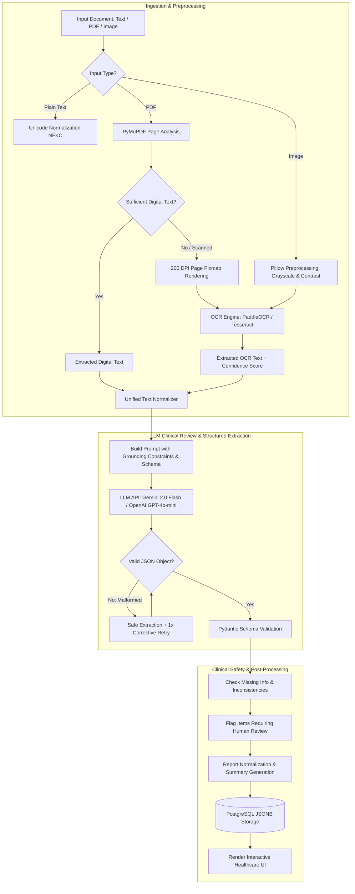

# AI/ML Architecture & Design Document

## 1. Overview & Objective

The AI/ML subsystem in the **AI Clinical Document Reviewer** automates the extraction and synthesis of clinical facts from raw documents without introducing hallucinations, unwarranted diagnostic claims, or ungrounded assumptions.

---

## 2. Complete Pipeline Flow Diagram



---

## 3. Model & Provider Selection

### Configurable Model Architecture
The system supports multiple providers through an abstraction layer in `backend/app/services/ai_service.py`:
- **Default Recommended**: **Google Gemini 2.0 Flash** / **Gemini 1.5 Flash**
- **Alternative Supported**: **OpenAI GPT-4o-mini** / **GPT-4o** / OpenAI-compatible REST endpoints (Ollama, Groq, vLLM).

### Selection Rationale:
1. **Deterministic JSON Support**: Native structured output and `responseMimeType: "application/json"` guarantees valid JSON structure directly from the decoder.
2. **Context Window & Speed**: Gemini 2.0 Flash offers sub-second response times and a 1M+ token context window, accommodating lengthy multi-page clinical records and discharge summaries.
3. **Medical Vocabulary & Nuance**: High comprehension of clinical abbreviations (e.g., "BID", "PRN", "NKDA", "SpO2"), lab values, and symptom timelines.
4. **Cost Efficiency**: High throughput and low latency per token make it optimal for production deployment.

---

## 4. Document Processing & OCR Engineering

### A. PDF Processing
- Uses **PyMuPDF (`fitz`)**, one of the fastest and most memory-efficient C-backed PDF parsing libraries.
- Two-tier extraction strategy:
  1. **Tier 1 (Digital Extraction)**: Fast extraction of text characters embedded in the PDF DOM.
  2. **Tier 2 (Scanned / Rasterized Fallback)**: If extracted character length is insufficient (< 50 chars) or scanned pages are detected, pages are rasterized to RGB images at 200 DPI and processed through the OCR pipeline.

### B. Image Preprocessing with Pillow
- Standardizes incoming color spaces (converts RGBA/CMYK to RGB).
- Dynamic resolution bounds: Resizes images with resolutions below 600px up to 1200px (improves character recognition on small prescription slips), and caps extreme sizes (> 3500px) to prevent memory exhaustion.
- Applies grayscale luminance conversion and localized contrast enhancement (`ImageEnhance.Contrast`).

### C. Dual OCR Engine Architecture
- **RapidOCR / PaddleOCR ONNX**: Default embedded engine running on ONNX Runtime. Requires no external OS binary installations and runs cross-platform.
- **Tesseract OCR (via pytesseract)**: Configured in the Docker container and production environments for enterprise Linux deployments.
- Outputs confidence scores (0.0 to 1.0) and generates extraction warnings if confidence drops below 0.60.

---

## 5. Hallucination Reduction & Guardrails

The application is explicitly designed as a **Document Review Assistant**, not a primary diagnostic engine. To prevent AI hallucinations:

1. **System Prompt Grounding**:
   ```
   "Use ONLY information present in the supplied document.
   Do not invent, assume, infer, or hallucinate patient information.
   Do not create a diagnosis that is not stated or supported by the document.
   The purpose of this system is document review and structured information extraction.
   It does not replace professional medical judgment."
   ```
2. **Low-Temperature Sampling**: Temperature is explicitly set to `0.0` across all API calls to eliminate stochastic sampling and hallucinated drift.
3. **Explicit Handling of Absent Data**:
   - Patient demographics: Returns `"Not provided"` if unmentioned.
   - Allergies: Returns `"Not documented"` if unmentioned. (Explicitly forbids assuming "No allergies").
   - Diagnoses: Strictly partitions into `"documented"` vs `"suspected"` / `"uncertain"`.
4. **Omission & Inconsistency Trackers**:
   - `missing_information`: Flags relevant medical data typically expected for the case that is absent from the note (e.g., missing lab result or unrecorded vitals).
   - `potential_inconsistencies`: Explicitly identifies discrepancies (e.g., temperature stated as 38.5°C in triage and 37.2°C in physician note).
   - `requires_review`: Prominently flags low-confidence OCR text or ambiguous medical terms for clinician verification.

---

## 6. Schema Validation & Safe Parsing

### Pydantic Validation
The response is strictly validated against `StructuredClinicalReport`:
- `report_summary`: string
- `patient_information`: object (name, age, gender, dob, mrn, other_demographics)
- `symptoms`: array of objects (symptom, duration, severity, notes)
- `diagnoses`: array of objects (condition, status, notes)
- `medications`: array of objects (medication, dosage, frequency, route, notes)
- `vitals`: object (blood_pressure, heart_rate, temperature, respiratory_rate, oxygen_saturation, weight, other_vitals)
- `allergies`: array of objects (allergy, reaction)
- `clinical_observations`: array of strings
- `clinical_concerns`: array of strings
- `missing_information`: array of strings
- `potential_inconsistencies`: array of strings
- `requires_review`: array of strings

### Resilience & Retry Flow
1. **Regex Extraction**: Strips leading/trailing conversational text and markdown code blocks (` ```json ... ``` `).
2. **Single-Attempt Retry**: If JSON parsing or Pydantic validation fails, the service issues a single corrective prompt containing specific error diagnostics.
3. **Graceful Error Envelope**: If the retry fails, the backend marks the analysis record as `FAILED`, saves the diagnostic message in `error_message`, and returns a structured error response with HTTP status code without crashing.

---

## 7. Known Limitations & Future Improvements

### Limitations:
- Very dense or cursive handwriting on physical paper forms may result in low OCR confidence.
- Single-page batch processing: Extremely large multi-hundred-page records should ideally be chunked with map-reduce.

### Future Improvements:
- Fine-tuned medical LLMs (e.g., Med-PaLM) for specialized oncology/cardiology terminology.
- Integration of SNOMED CT and RxNorm ontology codes into medication and diagnosis outputs.
- Asynchronous task queue (Celery / Redis) for background processing of multi-gigabyte document batches.
