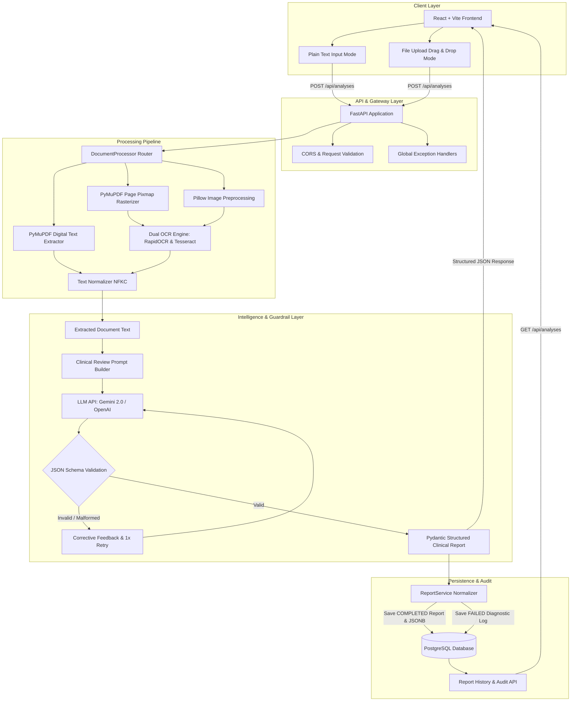
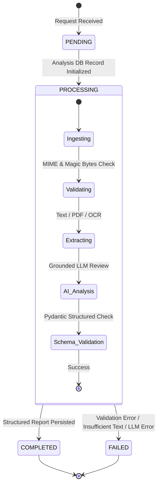
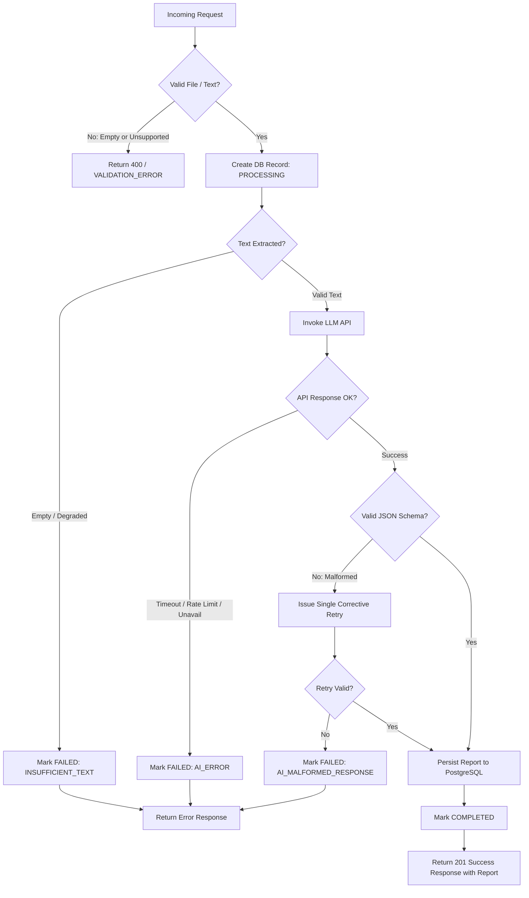

# Architecture Diagrams & Data Flows

## 1. System Architecture Diagram

```mermaid
flowchart TD
    subgraph Client Layer
        A[React + Vite Frontend]
        A1[Plain Text Input Mode]
        A2[File Upload Drag & Drop Mode]
        A --> A1
        A --> A2
    end

    subgraph API & Gateway Layer
        B[FastAPI Application]
        B1[CORS & Request Validation]
        B2[Global Exception Handlers]
        B --> B1
        B --> B2
    end

    subgraph Processing Pipeline
        C[DocumentProcessor Router]
        D1[PyMuPDF Digital Text Extractor]
        D2[PyMuPDF Page Pixmap Rasterizer]
        D3[Pillow Image Preprocessing]
        E[Dual OCR Engine: RapidOCR & Tesseract]
        F[Text Normalizer NFKC]
        
        C --> D1
        C --> D2
        C --> D3
        D2 --> E
        D3 --> E
        D1 --> F
        E --> F
    end

    subgraph Intelligence & Guardrail Layer
        G[Extracted Document Text]
        F --> G
        H[Clinical Review Prompt Builder]
        G --> H
        I[LLM API: Gemini 2.0 / OpenAI]
        H --> I
        J{JSON Schema Validation}
        I --> J
        J -->|Invalid / Malformed| K[Corrective Feedback & 1x Retry]
        K --> I
        J -->|Valid| L[Pydantic Structured Clinical Report]
    end

    subgraph Persistence & Audit
        M[ReportService Normalizer]
        L --> M
        N[(PostgreSQL Database)]
        M -->|Save COMPLETED Report & JSONB| N
        M -->|Save FAILED Diagnostic Log| N
        N --> O[Report History & Audit API]
    end

    A1 -->|POST /api/analyses| B
    A2 -->|POST /api/analyses| B
    B --> C
    O -->|GET /api/analyses| A
    L -->|Structured JSON Response| A
```

---

## 2. Analysis Lifecycle State Machine

```mermaid
stateDiagram-v2
    [*] --> PENDING: Request Received
    PENDING --> PROCESSING: Analysis DB Record Initialized
    
    state PROCESSING {
        [*] --> Ingesting
        Ingesting --> Validating: MIME & Magic Bytes Check
        Validating --> Extracting: Text / PDF / OCR
        Extracting --> AI_Analysis: Grounded LLM Review
        AI_Analysis --> Schema_Validation: Pydantic Structured Check
        Schema_Validation --> [*]: Success
    }

    PROCESSING --> COMPLETED: Structured Report Persisted
    PROCESSING --> FAILED: Validation Error / Insufficient Text / LLM Error
    
    COMPLETED --> [*]
    FAILED --> [*]
```

---

## 3. Error Handling and Recovery Flow

```mermaid
flowchart TD
    A[Incoming Request] --> B{Valid File / Text?}
    B -->|No: Empty or Unsupported| C[Return 400 / VALIDATION_ERROR]
    B -->|Yes| D[Create DB Record: PROCESSING]
    
    D --> E{Text Extracted?}
    E -->|Empty / Degraded| F[Mark FAILED: INSUFFICIENT_TEXT]
    F --> G[Return Error Response]
    
    E -->|Valid Text| H[Invoke LLM API]
    H --> I{API Response OK?}
    I -->|Timeout / Rate Limit / Unavail| J[Mark FAILED: AI_ERROR]
    J --> G
    
    I -->|Success| K{Valid JSON Schema?}
    K -->|No: Malformed| L[Issue Single Corrective Retry]
    L --> M{Retry Valid?}
    M -->|No| N[Mark FAILED: AI_MALFORMED_RESPONSE]
    N --> G
    M -->|Yes| O[Persist Report to PostgreSQL]
    K -->|Yes| O
    
    O --> P[Mark COMPLETED]
    P --> Q[Return 201 Success Response with Report]
```
