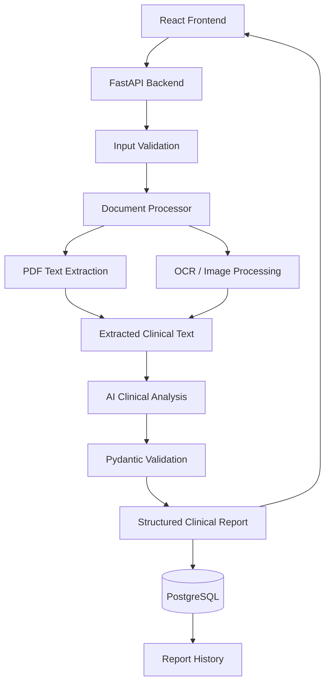

# Architecture Overview

## 1. System Summary

The **AI Clinical Document Reviewer** is a production-grade web application engineered to ingest, validate, process, and analyze heterogeneous clinical documentation (plain text, PDFs, scanned records, and images). It extracts source-grounded clinical facts, detects omissions and contradictions, flags uncertainties for clinical review, and stores structured reports in PostgreSQL.

---

## 2. End-to-End Architectural Diagram

---

## 3. Core Component Breakdown

### A. React Frontend (`frontend/`)
- **Technology Stack**: React 18, Vite, React Router v6, Axios, Modern CSS.
- **Responsibilities**:
  - Provides a healthcare-grade, accessible user interface.
  - Dual input modalities: Plain Text Editor and Document Drag-and-Drop (PDF, PNG, JPG, JPEG).
  - Client-side validation: File size limits (10 MB), allowed MIME types, and non-empty checks.
  - Multi-stage animated progress tracker reflecting the backend pipeline stages:
    1. Reading document
    2. Extracting information
    3. Analyzing clinical content
    4. Generating structured report
    5. Saving report
  - Comprehensive clinical report presentation (Summary, Demographics, Vitals, Medications, Diagnoses, Allergies, Concerns, Inconsistencies, and Review alerts).
  - History viewer with debounced search, status filtering, and audit trail viewing.
  - Responsive layout and print stylesheet for clinical record generation.

### B. FastAPI Backend (`backend/app/`)
- **Technology Stack**: Python 3.11+, FastAPI, Pydantic v2, SQLAlchemy 2.0, Uvicorn.
- **Responsibilities**:
  - Exposes RESTful API endpoints (`/api/analyses`, `/api/health`).
  - Request validation and content-type parsing (JSON & Multipart Form-Data).
  - CORS security policies and configurable environment settings via `pydantic-settings`.
  - Secret-redacted structured logging.
  - Standardized API envelope for consistent error and success serialization.

### C. Document Processing Pipeline (`app/services/`)
- **Text Processor**: Unicode normalization (NFKC), newline standardization, whitespace trimming.
- **PDF Processor (`pdf_processor.py`)**:
  - Powered by PyMuPDF (`fitz`).
  - Attempts high-speed digital text extraction.
  - Evaluates text density; if scanned or insufficient (< 50 chars), rasterizes pages to high-resolution pixmaps (200 DPI) and triggers OCR.
  - Handles corrupted files, password protection, and blank pages.
- **Image Processor (`image_processor.py`)**:
  - Powered by Pillow (PIL).
  - Validates image headers, performs dynamic resizing (bounds between 600px and 3500px), converts to grayscale, and applies contrast enhancement.
- **OCR Engine (`ocr_service.py`)**:
  - Dual-engine architecture:
    1. **RapidOCR / PaddleOCR ONNX**: Embedded machine learning OCR engine providing native cross-platform execution without external binaries.
    2. **Tesseract OCR**: Leveraged via `pytesseract` when system binaries are installed (e.g. in Docker container).
  - Calculates extraction confidence metrics and tracks quality warnings.

### D. AI Clinical Analysis Service (`ai_service.py`)
- **Model Support**: Google Gemini (e.g. `gemini-2.0-flash`, `gemini-1.5-flash`) and OpenAI (e.g. `gpt-4o-mini`) via configurable provider selection.
- **Hallucination Mitigation**:
  - Strict system prompt mandating that the model act as a document review assistant, not an independent diagnosing physician.
  - Temperature set to `0.0` for deterministic, reproducible extraction.
  - Explicit instruction to output "Not provided" or "Not documented" rather than guessing.
  - Distinguishes between "Documented" and "Suspected / Uncertain" diagnoses.
- **Structured JSON & Validation**:
  - Guaranteed JSON schema compliance via Pydantic model `StructuredClinicalReport`.
  - Safe regex-based markdown cleaner and JSON parser.
  - Automatic single-retry mechanism with corrective prompts if malformed output is encountered.

### E. Persistence Layer (`database.py`, `models/`, `report_service.py`)
- **Database**: PostgreSQL 15+ (with SQLite support for unit testing).
- **ORM**: SQLAlchemy 2.0 Declarative Models.
- **Storage**:
  - Relational metadata: UUID, input type, filename, status, processing time, timestamps.
  - Document & Report: `structured_report` stored as native PostgreSQL `JSONB` for schema flexibility and efficient querying.
- **Transactions**: Explicit atomic transactions with rollback protection on errors.

---

## 4. Security & Compliance Boundaries
1. **Zero Secret Leakage**: No API keys or credentials exist in the client-side bundle. All LLM calls originate server-side.
2. **Secret Redaction in Logging**: Custom logging filter automatically masks API keys, bearer tokens, and credentials.
3. **Synthetic Data Enforcement**: All sample datasets and demonstration workflows strictly utilize synthetic fictional data. Clear clinical review disclaimers are present throughout the UI and backend payloads.
